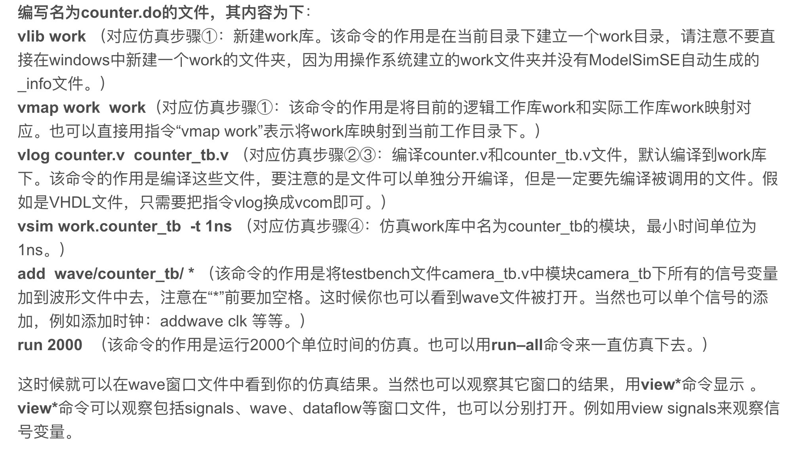

# 0. Write-Ahead

## 0.0 学生信息

姓名：（因上传github仓库已隐藏）

学号：（因上传github仓库已隐藏）

## 0.1 baseline的解释

首先，如何理解整个项目的运行流程，参考这篇非常好的博文，当时看完瞬间解决了我的疑惑，也和本个baseline内容非常契合，博客链接如下。

[modelsim仿真中 do文件的写法技巧](https://blog.csdn.net/wordwarwordwar/article/details/80445775)

使用verilog语言描述处理器并进行仿真的流程如下（注意本次试验只需要Modelsim软件即可，不需要像本科时下载Quartus，Modelsim可以写代码，编译和仿真，虽然我是用vscode写的）

1. 使用编辑器编写verilog代码
2. 编译verilog代码
3. 使用modelsim进行仿真

对于第一步，使用modelsim自带的编辑器或者vscode甚至文本文档都可以。

对于第二步，具体分为建立工程和工程库（vlib命令和vmap命令），加载设计文件和编译源文件（vlog命令）。这些步骤可以使用modelsim的图形化界面进行，也可以直接使用命令行执行（命令行窗口打开路径：view->Transcript），baseline非常贴心的写好了所有步骤的命令，并且放在了do文件中，只需要在命令行中执行`do D:/pe_exp/sim/build_0.do`，就完成了第二步的所有步骤。

对于第三步，同样是可以使用modelsim的图形化界面进行，也可以直接使用命令行执行，当然我们选择命令行执行，使用vsim命令，baseline的`sim_run_x.do`中写好了参数，直接执行do文件更方便更快捷。

在wave中添加需要观察的变量，在命令行窗口中执行`run -all`即可。

其次，浅浅解释一下`tp_top_2.v`，即testbench生成输入信号和读取输入数据和测试模块。老师使用了`$random()`来随机控制是否信号valid。（后面懒得写了，基本就是四套测试数据，weight和neru的ready控制读入下一行向量，inst的ready控制读入下一个矩阵，也即下一个测试数据）

最后，总的实验流程：

1. 使用vscode完成代码
2. 打开modelsim，找到transcript窗口，命令行输入`do D:/pe_exp/sim/build_0.do `
3. 找到transcript窗口，命令行输入`do D:/pe_exp/sim/sim_run_0.do `
4. 在sim窗口选择要观察的模块，然后去object窗口选择该模块要观察的波形
5. 找到transcript窗口，命令行输入`run -all `
6. 缩放波形，观察结果

## 0.2 baseline的问题

baseline是无法直接运行的，有一些错误需要更改。

1. `sim_run_x.do`中，`vsim`指令的tp_top表示仿真顶层模块名字，但是`tp_top_x.v`文件中的顶层模块名字并没有数字后缀，所以需要把三个`tp_top_x.v`文件中的模块名字加上数字后缀（当然也可以改三个`sim_run_x.f`文件中参数，等效）。
2. `compile_2.f`中，添加`D:/pe_exp/src/matrix_pe/matrix_pe.v`，该文件也是实验三的文件，但是却没有写。
3. 群里同学说data文件夹下的数据有问题，需要重新生成。我没有测试是否有问题，是直接运行了一下`data_gen.py`

## 0.3 实验手册的问题

1. 6.5.3.1中，"do path to build/build.do"，其中path to build不是指令，而是一种说明，坑了我好久，应该是`do <path store your build>/build.do`
2. 6.5.3.4中，运行仿真应该是`run -all`，而不是`run all`（虽然后面写的是正确的），运行后，会有提示框，询问是否finish，一定要点否，否则会关闭整个modelsim软件。

# 1. Experiment

实验结果不再进行过多说明，只展示每个实验结果检查正确的截图，和对应波形图位置。

## 1.0 exp0

## 1.1 exp1

## 1.2 exp2

